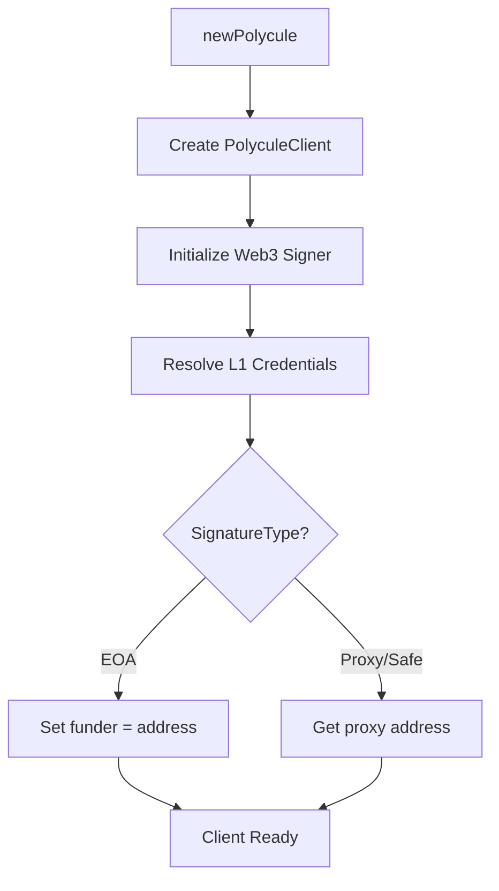

## Overview

The Polycule Nim SDK is organized into four primary modules that handle different aspects of interacting with Polymarket:

<CardGroup cols={2}>
  <Card title="CLOB" icon="book">
    Central Limit Order Book API client for trading operations
  </Card>
  <Card title="EVM" icon="ethereum">
    Ethereum blockchain interaction and smart contract interfaces
  </Card>
  <Card title="WebSockets" icon="signal-stream">
    Real-time market data and user event streams
  </Card>
  <Card title="Gamma" icon="chart-line">
    Market metadata and information API
  </Card>
</CardGroup>

## Module Structure

The SDK follows a modular architecture located in `src/polycule/`:

```nim
import polycule
# Imports all modules: clob, evm, gamma, websockets, global
```

### CLOB Module

The CLOB (Central Limit Order Book) module handles all trading operations:

<Tabs>
  <Tab title="Structure">
    Located in `src/polycule/clob/`, the module contains:
    - `l1_methods.nim` - L1 authentication and order signing
    - `l2_methods.nim` - L2 API operations (post orders, cancel, queries)
    - `public_methods.nim` - Public API endpoints (no auth required)
    - `common.nim` - Shared utilities and validation
  </Tab>
  <Tab title="Exports">
    ```nim
    # From src/polycule/clob/clob.nim
    export common, l1_methods, l2_methods, public_methods
    ```
  </Tab>
</Tabs>

### EVM Module

Handles Ethereum blockchain interactions and smart contract operations:

<Tabs>
  <Tab title="Structure">
    Located in `src/polycule/evm/`, the module contains:
    - `common.nim` - Chain constants, contract addresses, EVM types
    - `ctf.nim` - Conditional Token Framework contract interface
    - `ctf_exchange.nim` - CTF Exchange contract operations
    - `erc20.nim` - ERC20 token interactions (USDC)
    - `eip712.nim` - Typed data signing (EIP-712)
  </Tab>
  <Tab title="Exports">
    ```nim
    # From src/polycule/evm/evm.nim
    export common, ctf, ctf_exchange, eip712, erc20
    ```
  </Tab>
</Tabs>

<Note>
  The SDK supports both Polygon mainnet (chainId 137) and Amoy testnet (chainId 80002) with different contract addresses configured per chain.
</Note>

### WebSockets Module

Provides real-time streaming of market data and user events:

<Tabs>
  <Tab title="Components">
    - **MarketWss** - Market-level events (books, prices, trades)
    - **UserWss** - User-specific events (orders, trades)
    - **Rtds** - Real-time data socket (crypto prices, external data)
  </Tab>
  <Tab title="Structure">
    Located in `src/polycule/websockets/`:
    - `websockets.nim` - Main connection and routing logic
    - `wss/wss.nim` - Market and user WebSocket implementations
    - `rtds/rtds.nim` - Real-time data socket implementation
  </Tab>
</Tabs>

### Gamma Module

Accesses Polymarket's Gamma API for market metadata:

```nim
# From src/polycule/gamma/gamma.nim
proc getMarket*(slug: string, includeTag = false): 
  Future[Opt[GammaMarketResponse]]
```

Returns market information including:
- Condition ID
- Market slug and question
- Neg-risk status
- Question ID

## Core Types

The `global.nim` module defines core types used throughout the SDK:

### Client Types

<CodeGroup>
```nim PolyculeClient
type
  PolyculeClient* = ref object
    config*: PolyculeConfig
    user*: Opt[User]
    currentMarket*: Opt[Market]
```

```nim PolyculeConfig
type
  PolyculeConfig* = object
    rpcUrl*: Opt[Uri]
    builderCreds*: Opt[ApiKeyCreds]
```

```nim User & Wallet
type
  User* = ref object
    wallet*: Wallet

  Wallet* = ref object
    signatureType*: SignatureType
    funder*: Address
    signer*: Web3
    auth*: Opt[ApiKeyCreds]
```
</CodeGroup>

### Market Types

```nim Market
type
  Market* = ref object
    slug*: string
    isNegrisk*: bool
    conditionId*: Opt[EvmBytes32]
    assetIds*: Opt[array[2, EvmUInt256]]
```

See [Markets](/concepts/markets) for detailed market handling.

### Trading Types

<Accordion title="Order Types">
  ```nim
  type
    Side* = enum
      BUY = "BUY"
      SELL = "SELL"

    OrderType* = enum
      GTC = "GTC"  # Good Till Canceled
      FOK = "FOK"  # Fill or Kill
      FAK = "FAK"  # Fill and Kill
      GTD = "GTD"  # Good Till Date

    TickSize* = enum
      TICK_0_1 = "0.1"
      TICK_0_01 = "0.01"
      TICK_0_001 = "0.001"
      TICK_0_0001 = "0.0001"
  ```
</Accordion>

<Accordion title="Price & Size Types">
  ```nim
  type
    Size* = distinct float
    Price* = distinct range[0.0 .. 1.0]
    Timestamp* = distinct int64
  ```
</Accordion>

## Initialization Flow

The SDK initialization follows this sequence:



<Steps>
  <Step title="Create Client">
    Initialize the `PolyculeClient` with configuration:
    ```nim
    let client = await newPolycule(
      signerKey,
      config,
      signatureType = SignatureType.EOA
    )
    ```
  </Step>
  
  <Step title="Web3 Setup">
    The SDK creates a Web3 instance with the provided RPC URL and sets the default account.
  </Step>
  
  <Step title="Authentication">
    L1 credentials are resolved via `resolveL1Creds()` - either from environment variables or by creating new API keys.
  </Step>
  
  <Step title="Funder Resolution">
    For EOA signatures, the funder is the signer address. For proxy wallets, it retrieves the proxy address.
  </Step>
</Steps>

## Contract Configuration

The SDK automatically selects contract addresses based on market type:

<CodeGroup>
```nim Standard Markets
ContractConfig(
  collateral: COLLATERAL_TOKEN,      # USDC
  ctf: CTF,                           # Conditional Token Framework
  exchange: CTF_EXCHANGE              # CTF Exchange
)
```

```nim Neg-Risk Markets
ContractConfig(
  collateral: NEGRISK_WRAPPED_COLLATERAL_TOKEN,
  ctf: NEGRISK_CTF,
  exchange: NEGRISK_CTF_EXCHANGE
)
```
</CodeGroup>

<Info>
  Contract addresses are defined in `src/polycule/evm/common.nim` and differ between Polygon mainnet and testnet.
</Info>

## Design Principles

<AccordionGroup>
  <Accordion title="Async/Await">
    All network operations use Nim's `chronos` async runtime for non-blocking I/O:
    ```nim
    proc buy*(client: PolyculeClient, ...): Future[Result[OrderResponse, string]] {.async.}
    ```
  </Accordion>

  <Accordion title="Result Types">
    Operations return `Result[T, string]` for explicit error handling:
    ```nim
    let orderResult = await client.buy(...)
    if orderResult.isOk():
      echo "Order ID: ", orderResult.value().orderID
    else:
      echo "Error: ", orderResult.error()
    ```
  </Accordion>

  <Accordion title="Optional Values">
    The SDK uses `Opt[T]` extensively for optional fields:
    ```nim
    if client.currentMarket.isSome():
      echo client.currentMarket.value().slug
    ```
  </Accordion>

  <Accordion title="Type Safety">
    Distinct types prevent common mistakes:
    ```nim
    let price = Price(0.65)  # Must be 0.0 to 1.0
    let size = Size(10.0)     # Distinct from generic float
    ```
  </Accordion>
</AccordionGroup>

## Next Steps

<CardGroup cols={2}>
  <Card title="Authentication" icon="key" href="/concepts/authentication">
    Learn about L1/L2 auth and API key management
  </Card>
  <Card title="Markets" icon="chart-mixed" href="/concepts/markets">
    Understand market types and position IDs
  </Card>
  <Card title="Trading" icon="arrow-right-arrow-left" href="/guides/trading">
    Start placing orders and executing trades
  </Card>
  <Card title="WebSockets" icon="signal-stream" href="/guides/websockets">
    Stream real-time market data
  </Card>
</CardGroup>