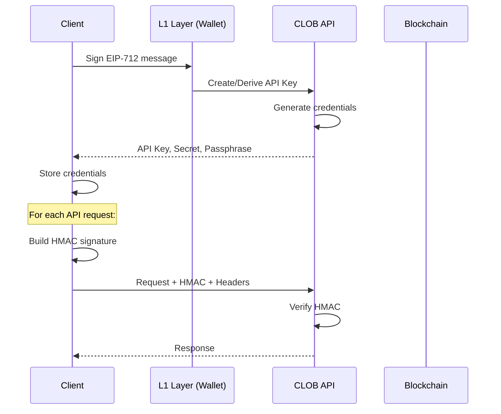

## Overview

Polymarket's CLOB uses a two-layer authentication system:

<CardGroup cols={2}>
  <Card title="L1 Authentication" icon="signature">
    Wallet-based cryptographic signatures (EIP-712)
  </Card>
  <Card title="L2 Authentication" icon="key">
    HMAC-signed API requests using derived credentials
  </Card>
</CardGroup>

This architecture allows secure trading without requiring on-chain transactions for every operation.

## Authentication Flow



## L1 Authentication

### EIP-712 Signature

L1 authentication uses [EIP-712](https://eips.ethereum.org/EIPS/eip-712) typed data signatures to prove wallet ownership:

```nim Reference
# From src/polycule/clob/l1_methods.nim:9-36
proc buildL1CLOBSig*(
    client: PolyculeClient, 
    timestamp: Timestamp, 
    nonce: EvmUInt256
): string =
  let
    privateKey = client.user.value().wallet.signer.privateKey.value()
    domain = buildEIP712Domain(
      name = "ClobAuthDomain",
      version = "1",
      chainId = CHAIN_ID
    )
    data = buildEIP712Struct(
      "ClobAuth",
      {
        "ClobAuth": @{
          "address": "address",
          "timestamp": "string",
          "nonce": "uint256",
          "message": "string"
        }
      },
      (
        privateKey.toPublicKey().to(Address),
        $timestamp,
        nonce,
        "This message attests that I control the given wallet"
      )
    )
  
  return privateKey.signTypedData(domain, data)
```

<Note>
  The signature proves you control the wallet without exposing the private key.
</Note>

### API Credential Management

The SDK provides automatic credential resolution:

<Tabs>
  <Tab title="Automatic (Recommended)">
    ```nim
    # Automatically resolves credentials
    let client = await newPolycule(
      signerKey,
      PolyculeConfig(rpcUrl: Opt.some(rpcUrl)),
      SignatureType.EOA
    )
    # Credentials are automatically derived or created
    ```
    
    The SDK will:
    1. Check for environment variables (`API_KEY`, `API_SECRET`, `API_PASSPHRASE`)
    2. Try to derive existing credentials
    3. Create new credentials if none exist
    4. Display credentials for you to save
  </Tab>
  
  <Tab title="Environment Variables">
    ```bash .env
    # Set these before running your application
    export API_KEY="your-api-key"
    export API_SECRET="your-base64-secret"
    export API_PASSPHRASE="your-passphrase"
    ```
    
    ```bash
    source .env
    nim c -r your_app.nim
    ```
  </Tab>
  
  <Tab title="Manual Creation">
    ```nim
    # Manually create API credentials
    proc createApiCreds*(
        client: PolyculeClient,
        timestamp: Timestamp,
        nonce: EvmUInt256
    ): Future[Opt[ApiKeyCreds]]
    
    # Get server timestamp first
    let timestamp = await getServerTimestamp()
    let creds = await client.createApiCreds(timestamp, evmUint256(0))
    ```
  </Tab>
</Tabs>

### Credential Resolution Process

The `resolveL1Creds` function implements the resolution logic:

```nim Reference
# From src/polycule/clob/l1_methods.nim:118-141
proc resolveL1Creds*(client: PolyculeClient): Future[Opt[ApiKeyCreds]] {.async.} =
  if existsEnv("API_KEY") and existsEnv("API_SECRET") and existsEnv("API_PASSPHRASE"):
    return Opt.some(
      ApiKeyCreds(
        apiKey: Opt.some(getEnv("API_KEY")),
        secret: Opt.some(getEnv("API_SECRET")),
        passphrase: Opt.some(getEnv("API_PASSPHRASE"))
      )
    )
  else:
    let creds = await client.deriveOrCreateApiCreds()
    if creds.isOk:
      echo "Generated new API credentials"
      echo "Add these to your .env file and run `source <env>`"
      echo "export API_KEY=", creds.get().apiKey.get()
      echo "export API_SECRET=", creds.get().secret.get()
      echo "export API_PASSPHRASE=", creds.get().passphrase.get()
      return creds
    else:
      return Opt.none(ApiKeyCreds)
```

<Steps>
  <Step title="Check Environment">
    First checks if `API_KEY`, `API_SECRET`, and `API_PASSPHRASE` environment variables exist.
  </Step>
  <Step title="Derive or Create">
    If not found, attempts to derive existing credentials from your wallet signature.
  </Step>
  <Step title="Display Credentials">
    If new credentials are created, they're displayed for you to save to your `.env` file.
  </Step>
</Steps>

### API Credential Types

```nim
type
  ApiKeyCreds* = object
    apiKey*: Opt[string]      # Public identifier
    secret*: Opt[string]       # Base64-encoded secret for HMAC
    passphrase*: Opt[string]   # Additional verification token
```

<Warning>
  Store your API credentials securely. Never commit them to version control or share them publicly.
</Warning>

## L2 Authentication

### HMAC-SHA256 Signing

All L2 API requests are authenticated using HMAC-SHA256 signatures:

```nim Reference
# From src/polycule/clob/l2_methods.nim:12-25
proc buildHmacSignature*(
    secret: string,
    timestamp: Timestamp,
    httpMethod, requestPath: string,
    body: string = ""
): string =
  let
    decodedSecret = base64.decode(secret)
    # Build message: timestamp + method + path + body
    message = $int64(timestamp) & httpMethod & requestPath & body
    hmacResult = hmac(sha256, decodedSecret, message)
    base64Result = base64.encode(hmacResult.data)
  # Convert to URL-safe base64
  result = base64Result.replace("+", "-").replace("/", "_")
```

### Message Construction

The HMAC signature is computed over a message with this exact format:

```
timestamp + httpMethod + requestPath + body
```

<Accordion title="Example HMAC Message">
  For a POST request to `/orders` with a JSON body:
  
  ```
  1234567890000POST/orders{"order":{"tokenId":"123",...}}
  ```
  
  Components:
  - `timestamp`: `1234567890000` (milliseconds)
  - `httpMethod`: `POST`
  - `requestPath`: `/orders` (includes query params if present)
  - `body`: Full JSON request body (empty string for GET/DELETE)
</Accordion>

### L2 Request Headers

Every authenticated L2 request includes these headers:

```nim Reference
# From src/polycule/clob/l2_methods.nim:63-80
HttpTable.init([
  ("POLY_ADDRESS", $address),
  ("POLY_SIGNATURE", signature),
  ("POLY_TIMESTAMP", $(serverTimestamp.value())),
  ("POLY_API_KEY", client.user.value().wallet.auth.value().apiKey.value()),
  ("POLY_PASSPHRASE", client.user.value().wallet.auth.value().passphrase.value()),
  ("Content-Type", "application/json")
])
```

<ParamField header="POLY_ADDRESS" type="string" required>
  Your wallet address (signer address)
</ParamField>

<ParamField header="POLY_SIGNATURE" type="string" required>
  The HMAC signature computed from request data
</ParamField>

<ParamField header="POLY_TIMESTAMP" type="string" required>
  Server timestamp obtained from `GET /time`
</ParamField>

<ParamField header="POLY_API_KEY" type="string" required>
  Your API key from L1 authentication
</ParamField>

<ParamField header="POLY_PASSPHRASE" type="string" required>
  Your API passphrase from L1 authentication
</ParamField>

### Creating L2 Headers

The SDK automatically creates authenticated headers:

```nim Reference
# From src/polycule/clob/l2_methods.nim:30-80
proc createL2Headers*(
    client: PolyculeClient,
    httpMethod: string,
    requestUrl: Uri,
    body: string = ""
): Future[Opt[HttpTable]] {.async.} =
  # Get server timestamp
  let serverTimestamp = await retryAsync(
    getServerTimestampTask,
    "GET_SERVER_TIME"
  )
  
  if serverTimestamp.isOk():
    let
      requestPath = 
        if requestUrl.query.len > 0:
          fmt"{requestUrl.path}?{requestUrl.query}"
        else:
          requestUrl.path
      signature = buildHmacSignature(
        client.user.value().wallet.auth.value().secret.value(),
        serverTimestamp.value(),
        httpMethod,
        requestPath,
        body
      )
    
    return Opt.some(HttpTable.init([...]))
```

<Info>
  The SDK handles all HMAC signing automatically. You don't need to compute signatures manually.
</Info>

## Order Signing (EIP-712)

Orders must be signed using EIP-712 before submission:

```nim Reference
# From src/polycule/clob/l1_methods.nim:142-194
proc buildOrderSignature*(
    client: PolyculeClient,
    order: UserOrder,
    salt: EvmUInt256,
    makerAmount: EvmUInt256,
    takerAmount: EvmUInt256
): string =
  let
    funder = client.user.value().wallet.funder
    privateKey = client.user.value().wallet.signer.privateKey.value()
    signer = privateKey.toPublicKey().to(Address)
    domain = buildEIP712Domain(
      name = "Polymarket CTF Exchange",
      version = "1",
      chainId = CHAIN_ID,
      verifyingContract = client.currentMarket.value().contractConfig().exchange
    )
    orderStruct = buildEIP712Struct(
      "Order",
      {
        "Order": @{
          "salt": "uint256",
          "maker": "address",
          "signer": "address",
          "taker": "address",
          "tokenId": "uint256",
          "makerAmount": "uint256",
          "takerAmount": "uint256",
          "expiration": "uint256",
          "nonce": "uint256",
          "feeRateBps": "uint256",
          "side": "uint8",
          "signatureType": "uint8"
        }
      },
      (...order fields...)
    )
  
  return privateKey.signTypedData(domain, orderStruct)
```

### Order Structure

The signed order includes all trading parameters:

<Accordion title="Order Fields">
  - `salt`: Random value for uniqueness
  - `maker`: Funder address (who provides liquidity)
  - `signer`: Address that signed the order
  - `taker`: Specific taker address (0x0 for any)
  - `tokenId`: Outcome token being traded
  - `makerAmount`: Amount maker provides
  - `takerAmount`: Amount taker must provide
  - `expiration`: Unix timestamp (0 = no expiration)
  - `nonce`: Unique nonce per order
  - `feeRateBps`: Fee rate in basis points
  - `side`: 0 = BUY, 1 = SELL
  - `signatureType`: 0 = EOA, 1 = POLY_PROXY, 2 = POLY_GNOSIS_SAFE
</Accordion>

## Signature Types

The SDK supports three signature types:

<CodeGroup>
```nim EOA (Default)
enum SignatureType:
  EOA = 0  # Externally Owned Account

# Standard wallet signature
let client = await newPolycule(
  signerKey,
  config,
  SignatureType.EOA
)
```

```nim Polymarket Proxy
enum SignatureType:
  POLY_PROXY = 1  # Polymarket Proxy

# For Polymarket proxy wallets
let client = await newPolycule(
  signerKey,
  config,
  SignatureType.POLY_PROXY
)
```

```nim Gnosis Safe
enum SignatureType:
  POLY_GNOSIS_SAFE = 2  # Gnosis Safe

# For Gnosis Safe multisig wallets
let client = await newPolycule(
  signerKey,
  config,
  SignatureType.POLY_GNOSIS_SAFE
)
```
</CodeGroup>

<Note>
  For proxy wallets and Gnosis Safe, the `funder` address differs from the `signer` address.
</Note>

## Security Best Practices

<AccordionGroup>
  <Accordion title="Credential Storage">
    - Store API credentials in environment variables
    - Never commit credentials to version control
    - Use `.env` files and add them to `.gitignore`
    - Rotate credentials periodically
  </Accordion>

  <Accordion title="Private Key Management">
    - Never log or display private keys
    - Store private keys encrypted at rest
    - Use hardware wallets for production systems
    - Implement key rotation procedures
  </Accordion>

  <Accordion title="Request Signing">
    - Always use server timestamps from `/time` endpoint
    - Include full request body in HMAC computation
    - Verify signature format (URL-safe base64)
    - Handle timestamp synchronization errors
  </Accordion>

  <Accordion title="API Key Scope">
    - One API key per application/environment
    - Don't share API keys between services
    - Monitor API key usage for anomalies
    - Revoke compromised keys immediately
  </Accordion>
</AccordionGroup>

## Common Authentication Issues

<AccordionGroup>
  <Accordion title="Invalid Signature">
    **Cause**: HMAC signature doesn't match server calculation
    
    **Solutions**:
    - Verify you're using the server timestamp from `/time`
    - Check that request body matches exactly (no extra whitespace)
    - Ensure API secret is correctly base64-decoded
    - Verify HTTP method matches (GET, POST, DELETE)
  </Accordion>

  <Accordion title="Expired Timestamp">
    **Cause**: Timestamp too old or clock skew
    
    **Solutions**:
    - Always fetch fresh timestamp from `/time` endpoint
    - Synchronize system clock (use NTP)
    - Don't cache timestamps between requests
  </Accordion>

  <Accordion title="Missing Credentials">
    **Cause**: Environment variables not set
    
    **Solutions**:
    - Run `source .env` before starting application
    - Verify `.env` file exists and is readable
    - Check environment variable names are exact
  </Accordion>

  <Accordion title="Invalid API Key">
    **Cause**: API key revoked or doesn't exist
    
    **Solutions**:
    - Create new API credentials
    - Verify wallet address matches API key
    - Check you're using correct environment (testnet vs mainnet)
  </Accordion>
</AccordionGroup>

## Example: Complete Authentication Flow

```nim
import polycule
import std/[os, uri]

proc main() {.async.} =
  # Step 1: Set up private key
  let privateKey = PrivateKey.fromHex(
    getEnv("PRIVATE_KEY")
  )
  
  # Step 2: Configure RPC
  let config = PolyculeConfig(
    rpcUrl: Opt.some(parseUri("https://polygon-rpc.com"))
  )
  
  # Step 3: Initialize client (automatic auth)
  let client = await newPolycule(
    privateKey,
    config,
    SignatureType.EOA
  )
  
  # Credentials are now ready!
  # All subsequent API calls are automatically authenticated
  
  # Step 4: Use authenticated endpoints
  let orders = await client.getOpenOrders()
  if orders.isOk():
    echo "Found ", orders.value().count.get(), " open orders"

waitFor main()
```

## Next Steps

<CardGroup cols={2}>
  <Card title="Markets" icon="chart-mixed" href="/concepts/markets">
    Learn about market types and position IDs
  </Card>
  <Card title="Place Orders" icon="arrow-right-arrow-left" href="/guides/trading">
    Start trading with authenticated endpoints
  </Card>
  <Card title="API Reference" icon="code" href="/api/clob/l1-methods">
    Complete authentication method documentation
  </Card>
  <Card title="Architecture" icon="sitemap" href="/concepts/architecture">
    Understand the SDK module structure
  </Card>
</CardGroup>